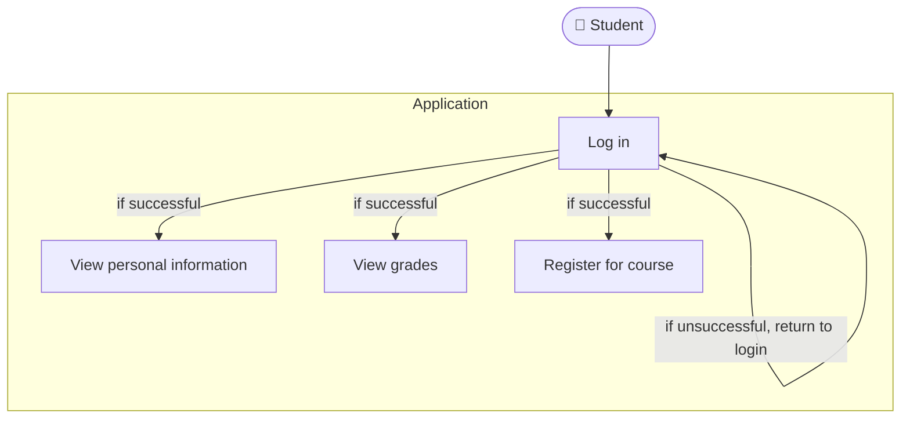
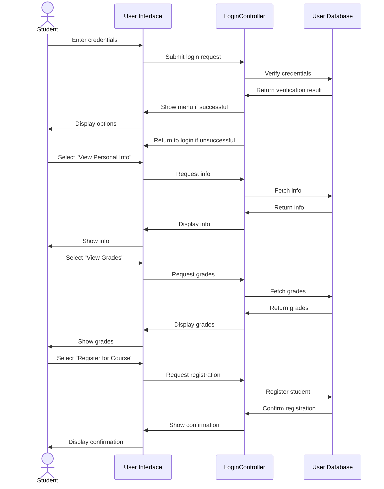
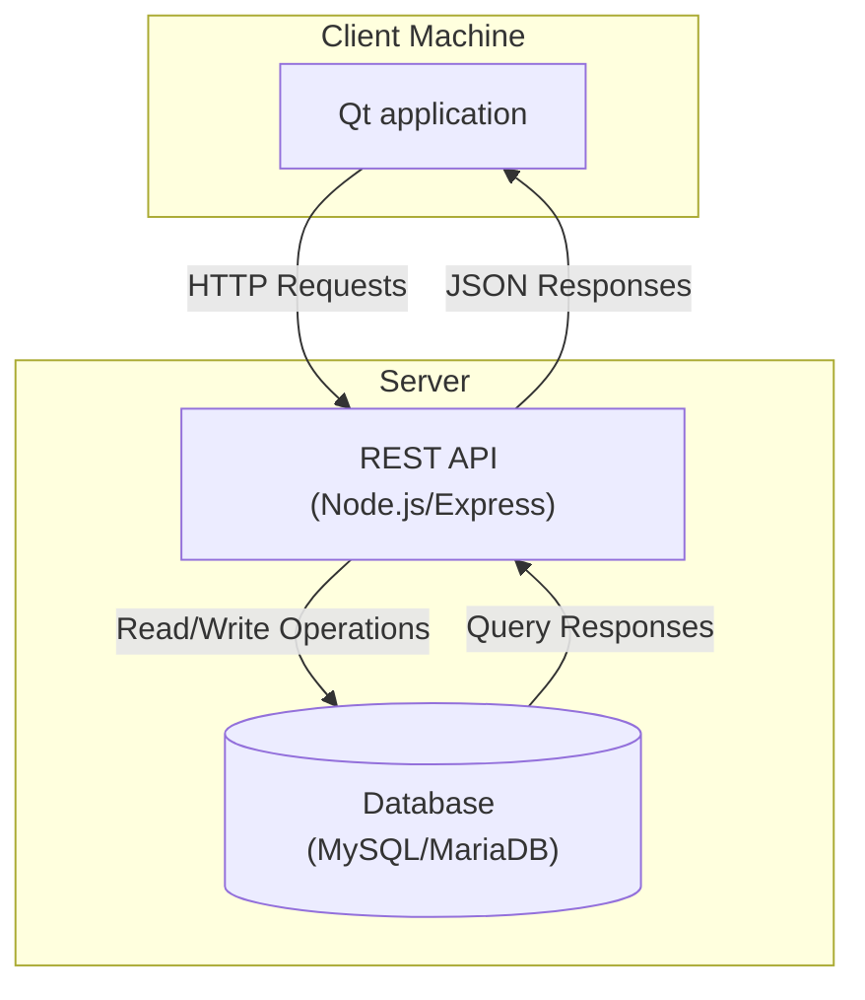
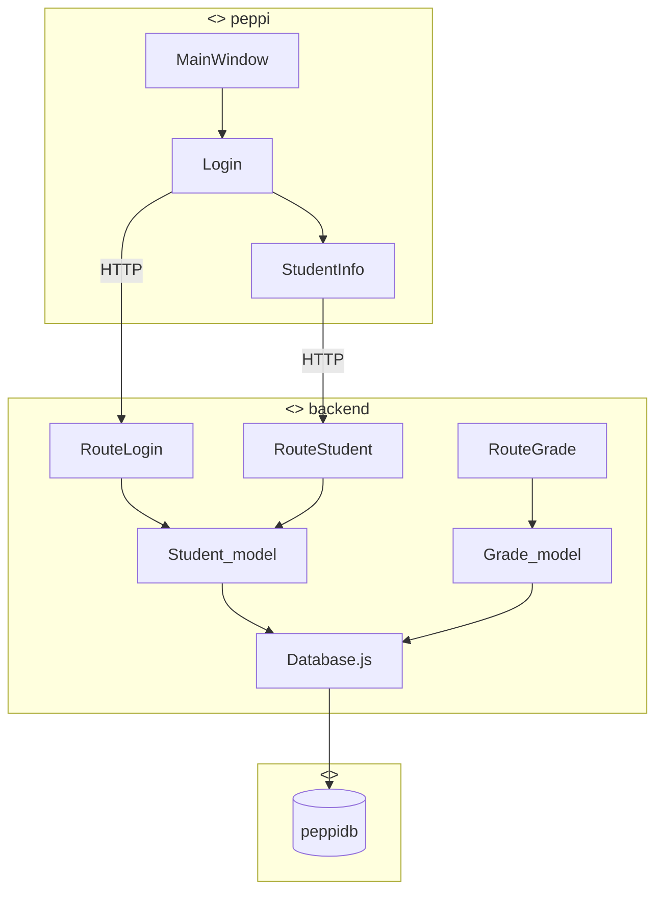
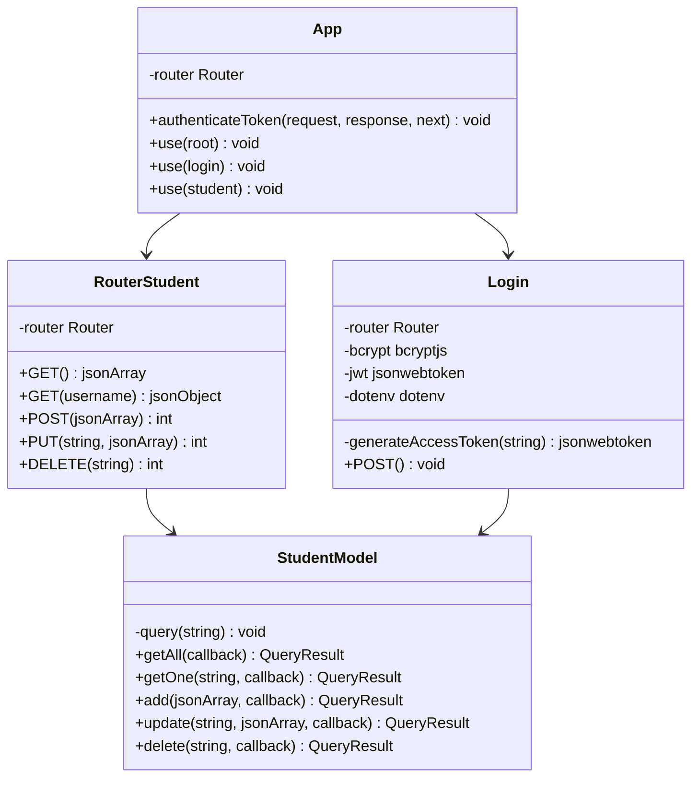
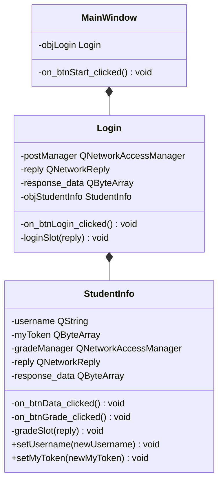

# Peppi esimerkki

Tämän esimerkin on tarkoitus auttaa ohjelmistoprojektin pankkiautomaatin suunnittelussa ja toteutuksessa. Esimerkin aiheena on Peppi oppilasrekisteriä vastaavan ohjelmiston rakentaminen. Esimerkin sovellukseen on otettu vain pieni osuus Peppi järjestelemästä.

## Järjestelmän toiminnan kuvaus

Sovellukseen toteutetaan seuraavat toiminnot:

- Voidakseen katsoa henkilötietonsa opiskelijan on kirjauduttava sovellukseen.
- Voidakseen katsoa arvosanansa opiskelijan on kirjauduttava sovellukseen.
- Voidakseen ilmoittautua kurssille opiskelijan on kirjauduttava sovellukseen.
- Jos kirjautuminen onnistuu opiskelijalle avautuu valikko, josta hän voi valita joko katso henkilötiedot tai katso arvosanat.
- Mikäli kirjautuminen ei onnistu, palataan kirjautumisruudulle.

## Käyttötapauskaavio

## Viestiyhteyskaavio

Seuraavaksi luotiin viestiyhteyskaavio

## Käyttöönottokaavio

Seuraavaksi suunniteltiin ohjelmiston arkkitehtuuria. Päätettiin, että käytetään MySQL-tietokantaa, REST API tehdään käyttäen Node.js/Express.js alustaa ja käyttäjän sovellus tehtään C++ ohjelointikielellä käyttäen Qt-frameworkkiä. Tällä perusteella laadittiin käyttöönottokaavio

## Komponenttikaavio

Seuraavaksi suunniteltiin ohjelmiston komponentit ja laadittiin komponenttikaavio

## Luokkakaavio

Seuraavaksi suunniteltiin ohjelmiston luokat ja laadittiin luokkakaaviot

**REST API:n luokkakaavio**

**Qt sovelluksen luokkakaavio**

---

## Tietokannan suunnittelu

Aluksi tietokannan ER-kaaviota hahmoteltiin kynällä ja paperilla ja saatiin seuraavat kuvat:

Kaaviota piirettiin siis niin pitkälle, että todettiin ettei monen-suhde-moneen yhteyksiä ole.

Tämän jälkeen tietokannan taulut luotiin MySQL-Workbench sovelluksella. Tauluihin merkittiin kentät, perusavaimet ja luotiin viiteavaimien avulla viite-eheys. Tämän jälkeen Workbenchillä generoitiin tietokanta ja ER-kaavio. Nyt tietokanta ja sen ER-malli ovat varmasti yhtäpitävät.

## Käyttöliittymän suunnittelu

Käyttöliittymää hahmoteltiin seuraavissa kuvissa. Tarkoitus olisi piirtää paremmat kuvat ennen toteutusta.

